# ProtonVPN-CLI Usage Documentation

This document provides an extensive guide on how to install and use ProtonVPN-CLI, as well as explanations about its advanced features and optional enhancements.

## Table of Contents

- [ProtonVPN-CLI Usage Documentation](#protonvpn-cli-usage-documentation)
  - [Table of Contents](#table-of-contents)
  - [Installation & Updating](#installation--updating)
    - [Installing from distribution repositories](#installing-from-distribution-repositories)
      - [Fedora](#fedora)
      - [CentOS & RHEL](#centos--rhel)
    - [Installing from PyPI](#installing-from-pypi)
      - [Installing ProtonVPN-CLI](#installing-protonvpn-cli)
      - [Updating ProtonVPN-CLI](#updating-protonvpn-cli)
      - [Uninstall](#uninstall)
    - [Installing in a virtual environment](#installing-in-a-virtual-environment)
      - [Install](#install)
      - [Update](#update)
      - [Uninstall](#uninstall-1)
  - [Initialization](#initialization)
  - [Example Installation on Ubuntu 18.04](#example-installation-on-ubuntu-1804)
  - [Commands](#commands)
    - [List of all Commands](#list-of-all-commands)
    - [Command Explanations](#command-explanations)
  - [Features](#features)
    - [DNS Management](#dns-management)
      - [DNS Leak Protection](#dns-leak-protection)
      - [Custom DNS](#custom-dns)
      - [Disabling DNS Management](#disabling-dns-management)
    - [IPv6 Leak Protection](#ipv6-leak-protection)
    - [Kill Switch](#kill-switch)
    - [Split Tunneling](#split-tunneling)
  - [Enhancements](#enhancements)
    - [Disable sudo password query](#disable-sudo-password-query)
    - [Configure alias for quicker access](#configure-alias-for-quicker-access)
    - [Auto-connect on boot](#auto-connect-on-boot)
      - [via Systemd Service](#via-systemd-service)

## Installation & Updating

### Installing from distribution repositories

For the following Linux distribution(s), install the official `protonvpn-cli` package:

#### Fedora

```sh
sudo dnf install -y protonvpn-cli
```

#### CentOS & RHEL

`protonvpn-cli` is available for CentOS/RHEL 7.x and 8.x via the [EPEL repositories](https://fedoraproject.org/wiki/EPEL).

**For CentOS/RHEL 7.x**:

```sh
sudo yum install https://dl.fedoraproject.org/pub/epel/epel-release-latest-7.noarch.rpm
sudo yum install protonvpn-cli
```

**For CentOS/RHEL 8.x**:

```sh
sudo dnf install https://dl.fedoraproject.org/pub/epel/epel-release-latest-8.noarch.rpm
sudo dnf install -y protonvpn-cli
```

### Installing from PyPI

**Dependencies:**

- openvpn
- dialog (optional, needed for interactive selection)
- pip for python3 (pip3)
- python3.5+
- setuptools for python3 (python3-setuptools)

Depending on your distribution, run the appropriate following command to install the necessary dependencies

| **Distro**                              | **Command**                                                        |
|:----------------------------------------|:------------------------------------------------                   |
|Fedora/CentOS/RHEL                       | `sudo dnf install -y openvpn dialog python3-pip python3-setuptools`|
|Ubuntu/Linux Mint/Debian and derivatives | `sudo apt install -y openvpn dialog python3-pip python3-setuptools`|
|OpenSUSE/SLES                            | `sudo zypper in -y openvpn dialog python3-pip python3-setuptools`  |
|Arch Linux/Manjaro                       | `sudo pacman -S openvpn dialog python-pip python-setuptools`       |

#### Installing ProtonVPN-CLI

Installation happens via Python's package manager PIP.

*Note: Make sure to run pip with sudo, so it installs globally and recognizes the command with sudo*

`sudo pip3 install protonvpn-cli`

#### Updating ProtonVPN-CLI

`sudo pip3 install protonvpn-cli --upgrade`

#### Uninstall

If you want to uninstall ProtonVPN-CLI, run `protonvpn configure` first and purge the configuration. Then uninstall through the package manager you used for installation.

For PIP this would be

`sudo pip3 uninstall protonvpn-cli`

Bye Bye 😔

### Installing in a virtual environment

If you're having trouble with the normal installation or don't want to install ProtonVPN-CLI as root, follow this guide to install it in a Python virtual environment.

#### Install

1. Install the virtualenv Python package

    `pip3 install virtualenv --user`

2. Create a virtual environment and activate it

    `virtualenv ~/ProtonVPN-CLI`

    `source ~/ProtonVPN-CLI/bin/activate`

3. Now that you're in the virtual environment, install ProtonVPN-CLI

    `pip install protonvpn-cli`

    As you're in the virtualenv, `pip` should be the same as `pip3`.

4. You should now have the executable `~/ProtonVPN-CLI/bin/protonvpn`.

    `which protonvpn`

5. If that works, deactivate the virtual environment again

    `deactivate`

6. Link the executable from above (output of the `which` command) to a PATH folder so you can access it from anywhere

    `sudo ln -sf ~/ProtonVPN-CLI/bin/protonvpn /usr/local/bin/protonvpn`

Now you should be able to use the protonvpn command from anywhere in the system without issues.

#### Update

1. Activate the virtual environment again

    `source ~/ProtonVPN-CLI/bin/activate`

2. Update ProtonVPN-CLI

    `pip install protonvpn-cli --upgrade`

3. Deactivate the virtual environment

    `deactivate`

#### Uninstall

1. Purge configuration

    `sudo protonvpn configure` -> `7` -> `y`

2. Delete the ProtonVPN-CLI folder

    `rm -rf ~/ProtonVPN-CLI`

3. Delete the symlink

    `sudo unlink /usr/local/bin/protonvpn`

## Initialization

Before you can use ProtonVPN-CLI, you need to initialize it. Run `sudo protonvpn init` and follow the prompts on the screen.

## Example Installation on Ubuntu 18.04

1. Installing dependencies

   To install ProtonVPN-CLI's dependencies, open a terminal and type `sudo apt install -y dialog openvpn python3-pip python3-setuptools` and confirm with Enter. Wait for the installation to finish

2. Installing ProtonVPN-CLI

   To install ProtonVPN-CLI type `sudo pip3 install protonvpn-cli` in the terminal and confirm with Enter again. It should look something like this:

   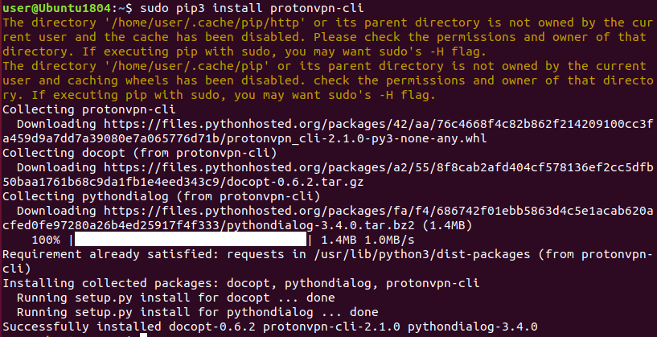

3. Initialize the ProtonVPN profile

   Now you have access to the `protonvpn` command. Before using ProtonVPN-CLI you need to initialize your profile. To do this, type `sudo protonvpn init`

   The client will ask you for your OpenVPN username and password. You can find them at https://account.protonvpn.com/account

   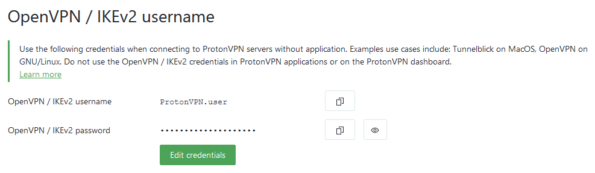

   Follow the prompts and enter your OpenVPN credentials:

   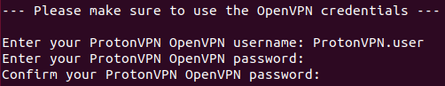

   Next, you need to select your plan. If you are currently enjoying the 7-day free trial of ProtonVPN Plus, select `3) Plus`.

   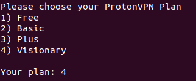

   *IMPORTANT: After your trial expires, you will need to reconfigure your plan to 1) Free. To set this up, enter `sudo protonvpn configure`. Then select `2) ProtonVPN Plan`. Finally, select `1) Free`.*

   Now, you need to choose which default transmission protocol you want to use. UDP is typically the faster option, while TCP is a more reliable protocol that's better suited for unstable connections and in restricted networks. The default selection is UDP.

   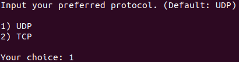

   Finally, confirm your input with `y`

   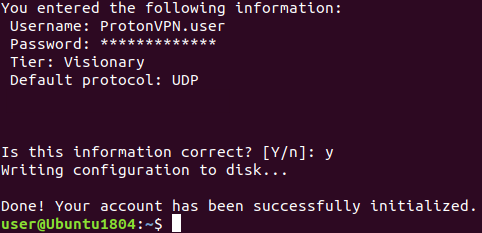

4. Connect to ProtonVPN

   You are now ready to connect to ProtonVPN. For example, you can let ProtonVPN-CLI find the fastest server for you. Just type `sudo protonvpn connect -f` and a connection will be established.

   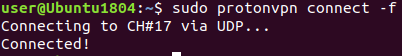

## Commands

### List of all Commands

| **Command**                       | **Description**                                       |
|:----------------------------------|:------------------------------------------------------|
|`protonvpn init`                   | Initialize ProtonVPN profile.                         |
|`protonvpn connect, c`             | Select a ProtonVPN server and connect to it.          |
|`protonvpn c [servername]`         | Connect to a specified server.                        |
|`protonvpn c -r`                   | Connect to a random server.                           |
|`protonvpn c -f`                   | Connect to the fastest server.                        |
|`protonvpn c --p2p`                | Connect to the fastest P2P server.                    |
|`protonvpn c --cc [countrycode]`   | Connect to the fastest server in a specified country. |
|`protonvpn c --sc`                 | Connect to the fastest Secure Core server.            |
|`protonvpn reconnect, r`           | Reconnect or connect to the last server used.         |
|`protonvpn disconnect, d`          | Disconnect the current session.                       |
|`protonvpn status, s`              | Print connection status.                              |
|`protonvpn configure`              | Change CLI configuration.                             |
|`protonvpn refresh`                | Refresh OpenVPN configuration and server data.        |
|`protonvpn examples`               | Print example commands.                               |
|`protonvpn --version`              | Display version.                                      |
|`protonvpn --help`                 | Show help message.                                    |

All connect options can be used with the `-p` flag to explicitly specify which transmission protocol is used for that connection (either `udp` or `tcp`).

### Command Explanations

You can see the full list of commands by running `protonvpn --help` and a list of examples by running `protonvpn examples`.

**Most of the commands need to be run as root, so use sudo with the commands in this guide!**

Before using any other commands, you need to initialize your profile:

`protonvpn init`

To connect to a server, you always need the `connect` option (or just `c`):

`protonvpn connect`

Running the above command will give you a menu that lets you select the country, server, and transmission protocol interactively:

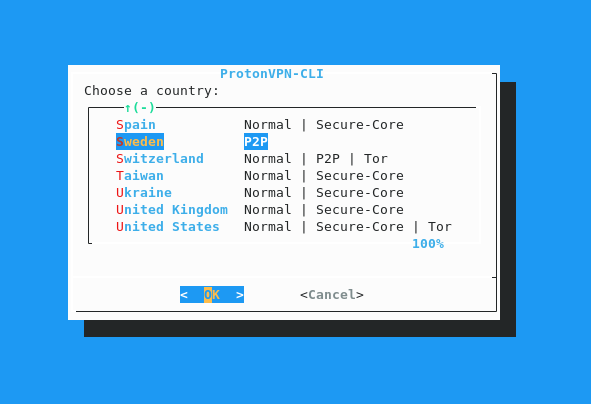

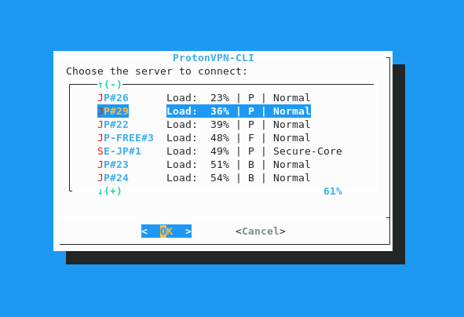

If you specify a server name after `connect`, you can connect directly to the server of your choice:

`protonvpn connect US-NY#6`

The server name can be written in several ways. For example, `usny6`, `us-ny-6` or `usny-06` are all valid formats.

To connect to the fastest server, you can use the `--fastest` or `-f` flag:

`protonvpn c --fastest`

`protonvpn c -f`

You can use the `--random` or `-r` flag to connect to a random server:

`protonvpn c -r`

There are several other variables to keep in mind when you want to connect to the “fastest” server. You can connect to the fastest server in a country, the fastest Secure Core server, the fastest P2P-enabled server, or the fastest Tor server.

Fastest server in a country (replace UK with the code of the desired country, e.g. `US` for USA, `JP` for Japan, `AU` for Australia, etc.):

`protonvpn c --cc UK`

Fastest Secure Core server:

`protonvpn c --sc`

Fastest P2P/torrent server:

`protonvpn c --p2p`

Fastest Tor server:

`protonvpn c --tor`

All connection methods (except the interactive menu) can be used with the `-p` flag to choose a transmission protocol. Possible values are either `TCP` or `UDP`. If that flag is not used, your connection will use the default transmission protocol you specified during the initialization:

Connect to the fastest server with TCP:

`protonvpn c -f -p TCP`

Connect to a random server with UDP:

`protonvpn c -rp UDP`

To disconnect the VPN, you need to use the `disconnect` or `d` option:

`protonvpn disconnect`

`protonvpn d`

If you're having trouble with your connection, e.g., because you switched networks or your device woke up from sleeping, you can easily reconnect to the last server with the `reconnect` or `r` option:

`protonvpn reconnect`

`protonvpn r`

If you want to see the status and information of your current connection, you can use the `status` or `s` option, which doesn't require root:

`protonvpn status`

`protonvpn s`

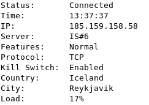

If you want to change the settings you selected during initialization, you can do this with the `configure` option, just follow the prompts to change your username/password, default protocol and so on:

`protonvpn configure`

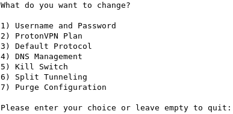

## Features

### DNS Management

#### DNS Leak Protection

ProtonVPN-CLI features a DNS Leak Protection feature, which makes sure that your online traffic uses ProtonVPN's DNS Servers. This prevents third parties (like your ISP) from being able to see your DNS queries (and, therefore, your browsing history).

ProtonVPN-CLI accomplishes this by updating the `/etc/resolv.conf` file when you connect to a VPN server, and makes sure that only ProtonVPN's DNS Server is written in this file. It will also backup the previous state of `/etc/resolv.conf` to revert all changes upon disconnection.

Please note that if you change your network (e.g., if you connect to a different WiFi hotspot) without first disconnecting, `/etc/resolv.conf` will likely be updated, which would remove ProtonVPN's DNS Servers. This could cause DNS leaks, so to keep your data safe, use `protonvpn reconnect` after changing your network.

**Enabling DNS Leak Protection**

To enable DNS Leak Protection, use the `protonvpn configure` command, then press `4` to choose DNS Management. Then press `1` to choose that you want to enable DNS Leak Protection.

After you activate this feature, your DNS queries will be secure.

#### Custom DNS

You can also make a custom DNS server your default for all your ProtonVPN connections. ProtonVPN-CLI lets you add up to 3 custom DNS Servers.

**Enabling Custom DNS**

To configure custom DNS Servers, use the `protonvpn configure` command, then press `4` to choose DNS Management. Then press `2` to choose that you want to configure a custom DNS Server. Now enter the IP addresses of up to 3 DNS Servers you want to use and confirm with Enter.

#### Disabling DNS Management

If you don't want ProtonVPN-CLI to do any changes to your DNS, you can do this as well. This will cause ProtonVPN-CLI to not touch `/etc/resolv.conf` and your device will always use the DNS servers configured by you or through your network.

**Disabling any DNS management**

To enable DNS Leak Protection use the `protonvpn configure` command, then press `4` to choose DNS Management. Then press `3` to disable any DNS management.

### IPv6 Leak Protection

ProtonVPN-CLI features an IPv6 Leak Protection feature. It makes sure that your IPv6 address is not leaked when you connect to a ProtonVPN server.

This feature is enabled by default, and for security reasons, it can't be disabled.

It works by detecting the IPv6 address, backing it up, and removing it from the default interface. When disconnecting, it adds the IPv6 address back to the default interface and deletes the backup.

### Kill Switch

ProtonVPN-CLI has a built-in Kill Switch that protects your data in case your VPN connection is interrupted or cut unexpectedly.

It works by replacing your existing iptables rules with custom rules that only allow data to go over the OpenVPN interface when the VPN connection is established. When you disconnect, ProtonVPN-CLI will revert iptables back to its previous state.

**Enabling Kill Switch**

To enable Kill Switch, open the configuration menu with `protonvpn configure`, then select `5` for Kill Switch and confirm the activation with either `1` or `2`, depending on your preference.

`1` will block access from your directly connected network (e.g. public WiFi) and is recommended for laptops that may connect to untrusted networks.

`2` will allow access from your directly connected network and is for computers that don't leave a secure and trusted LAN, like your home network.

On the next connection Kill Switch will be enabled.

*Note: Kill Switch only activates on unexpected connection drops. It will not persist through reboots and not activate when calling `protonvpn disconnect`. To simulate the Kill Switch, kill the OpenVPN process while connected with `sudo pkill openvpn`.*

### Split Tunneling

ProtonVPN-CLI features IP-based split tunneling. This means that you can exclude specific IP addresses or IP ranges from being routed through the VPN tunnel.

*Note: Split Tunneling does not work when the Kill Switch is enabled.*

**Enable Split Tunneling**

To enable Split Tunneling, open the configuration menu with `protonvpn configure`, then select Split Tunneling with `6`. Then confirm with `y`.

Now add the IPs you want to exclude (one IP at a time) or IP ranges in [CIDR notation](https://www.ipaddressguide.com/cidr).

If you want to have a big list of IPs or ranges that you want to exclude, it is recommended to add one IP via the method mentioned above. This will create the file `~/.pvpn-cli/split_tunnel.txt`. You can then paste the IPs or networks in CIDR notation in this file, one IP/network per line.

Then call `protonvpn refresh` to update the OpenVPN template with your excluded IP addresses.

## Enhancements

A list of optional enhancements that make using ProtonVPN-CLI easier.

### Disable sudo password query

You can disable the prompt for the sudo password when using ProtonVPN-CLI.

1. Enter `sudo which protonvpn` to find where the executable is installed

   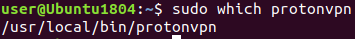

2. Enter `sudo visudo` to edit the sudoers file.

   Go to the bottom of the file and add the following line

   `user ALL = (root)  NOPASSWD: /usr/local/bin/protonvpn`

   *Note: Make sure to replace the name `user` with your own username and the path with the output of the previous command*

3. Save the file

Now you can use ProtonVPN-CLI without entering your password. This is best used with an [alias](#configure-alias-for-quicker-access).

### Configure alias for quicker access

An alias lets you access the `protonvpn` command more quickly and removes the need for you to type `sudo` all the time. To configure an alias, open your shell's rc file with your favorite editor. For bash, which is the default shell on most Linux distributions, this would be `~/.bashrc`. Now add the following lines at the end of the file:

`alias protonvpn='sudo protonvpn'`

`alias pvpn='sudo protonvpn'`

This lets you use ProtonVPN-CLI by simply typing `protonvpn` without sudo or just typing `pvpn`. For the latter, make sure you have uninstalled the old [bash-based ProtonVPN-CLI](https://github.com/ProtonVPN/protonvpn-cli) to avoid complications.

### Auto-connect on boot

#### via Systemd Service

Systemd is the current init system of most major Linux distributions. This guide shows you how to use systemd to automatically connect to a ProtonVPN Server when you boot up your system.

1. Find the location of the executable with `sudo which protonvpn`

   

2. Create the unit file in `/etc/systemd/system`

   `sudo nano /etc/systemd/system/protonvpn-autoconnect.service`

3. Add the following contents to this file

   ```
   [Unit]
   Description=ProtonVPN-CLI auto-connect
   Wants=network-online.target

   [Service]
   Type=forking
   ExecStart=/usr/local/bin/protonvpn connect -f
   Environment=PVPN_WAIT=300
   Environment=PVPN_DEBUG=1
   Environment=SUDO_USER=user

   [Install]
   WantedBy=multi-user.target
   ```

   Make sure to replace the username in the `Environment=SUDO_USER` line with your own username that has ProtonVPN-CLI configured.

   `PVPN_WAIT=300` means that ProtonVPN-CLI will check for 300 Seconds if the internet connection is working before timing out. Adjust this value as you prefer.

   Also replace the path to the `protonvpn` executable in the `ExecStart=` line with the output of Step 1.

   If you want another connect command than fastest as used in this example, just replace `-f` with what you personally prefer.

4. Reload the systemd configuration

   `sudo systemctl daemon-reload`.

5. Enable the service so it starts on boot

   `sudo systemctl enable protonvpn-autoconnect`

Now ProtonVPN-CLI should connect automatically when you boot up your system.
